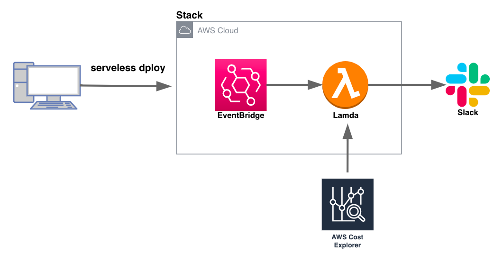

# AWS の請求金額の合計を週次で Slack に通知するアーキテクチャを構築する

## 

---

### ①Slack で Webhook URL 取得のための設定

1. 通知を飛ばすチャネルを作成する

   - 名前：aws-billing
   - 説明：AWS コスト監視

2. Incoming Webhook の追加

   - 通知先チャンネルから「アプリを追加する」を選択
   - Incoming Webhook を検索し追加する

3. 投稿先のチャンネルを選択し、「incomming Webhook インテグレーションの追加」を選択
4. 作成された Webhook URL をメモする（投稿時のアイコンなども設定できるので、必要に応じて設定）

<参考 URL>
[Slack の設定](https://dev.classmethod.jp/articles/notify-slack-aws-billing/)

---

### ②Serverless Framework プロジェクトの作成

1. Serverless Framework をインストールする（Serverless Framework は Node.js の cli ツール）

   ```
   npm install serverless -g
   ```

2. インストールされているか確認する

   ```
   sls -v
   ```

3. 作業ディレクトリの作成

   ```
   mkdir aws-cost-alert
   ```

4. AWS アカウントの設定

   ```
   sls config credentials --provider aws --key YOUR_KEY --secret YOUR_SECRET
   ```

5. テンプレートの作成

   ```
   serverless create -t aws-python3
   ```

6. Python の外部モジュールを読み込むため、そのためのプラグインを追加

   ```
   sls plugin install -n serverless-python-requirements
   ```

   - Slack へ通知を行うにあたって、Python の requests という外部モジュールを活用するため、serverless-python-requirements のインストール、package.json の作成、serverless.yml の plugins への追記が完了

---

### ③CostExplorer の設定

1. 設定>時間単位とリソースレベルのデータにチェックを入れ、設定を保存する

   - Cost Explorer に Lamda 関数からアクセスし、AWS の利用金額を取得する
   - Cost Explorer で時間単位、リソース単位で情報が取得できるので有効化しておくと良い

---

### ④ プロジェクトの作成とデプロイ

1. serverless.yml の作成

   - Lamda 関数と、そのトリガーとして Event Bride を指定
   - Amazon EventBridge で Cron 式で設定するイベント時刻はタイムゾーンが UTC（協定世界時）になっているため、日本標準時（JST）との時差を考慮する必要（+9 時間の時差の考慮をする）
   - Slack 通知先を指定する Webhook の URL は conf.yml から呼び出すようにし、環境変数として設定（hunder.py で下記の形で利用できるようになる）

   ```
   SLACK_WEBHOOK_URL = os.environ['SLACK_WEBHOOK_URL']
   ```

   - ポリシーには CloudWatch へのログの出力のための権限と、Cost Explorer からデータを取得するためのアクションを付与したポリシーをアタッチ

2. hunder.py の作成

   - post_slack（main method）：Cost Explorer のインスタンス化、合計金額の取得、Slack への通知内容を作成して通知する
   - get_total_billing：コスト集計範囲を取得し、その期間にかかったコストを取得し返却する（対象月にかかった AWS の合計金額を算出する）
   - get_monthly_cost_date_range：対象月のコスト算出対象の初日と当日の日付を取得する

3. conf.yaml の作成

   - Incoming Webhook の設定で取得した Webhook URL を記載
   - .gitignore に記載し、git 管理対象外にする

   ```
   SLACK_WEBHOOK_URL: https://hooks.slack.com/services/xxxxxxxx/~
   ```

4. requirements.txt の作成

   - 外部から読み込むモジュール名を記載（これによりデプロイ時にそのモジュールもデプロイされる）

   ```
   requests
   ```

5. デプロイする

   ```
   sls deploy
   ```

<参考 URL>

[AWS の請求額を Slack へ通知する仕組みの構築](https://fresopiya.com/2022/05/30/cost-slack/)

[【AWS】Lamda から Slack に通知する仕組みを Serverless Framework で構築する](https://fresopiya.com/2022/05/27/lamda-slack/)

[Cron 式の書き方](https://docs.aws.amazon.com/ja_jp/lambda/latest/dg/services-cloudwatchevents-expressions.html)

---

## 参考

#### aws configure の設定は下記の【コマンドを使用した構成設定の設定と表示】を参考に実施する

[設定ファイルと認証情報ファイルの設定](https://docs.aws.amazon.com/ja_jp/cli/latest/userguide/cli-configure-files.html)
